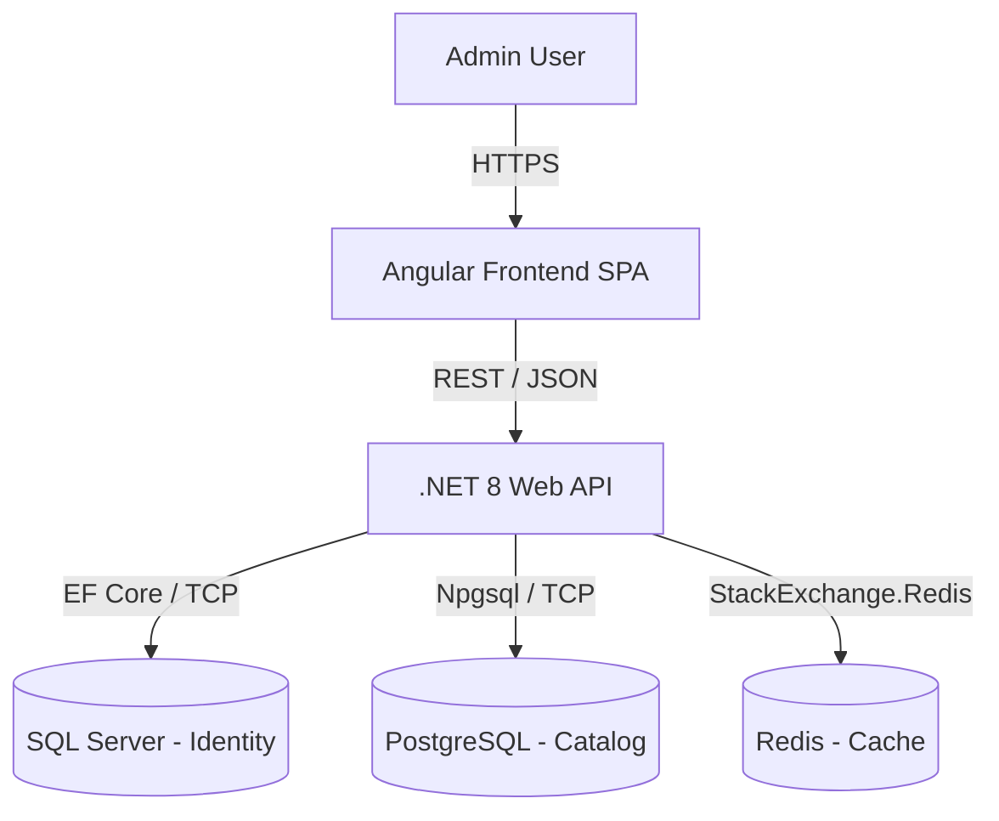
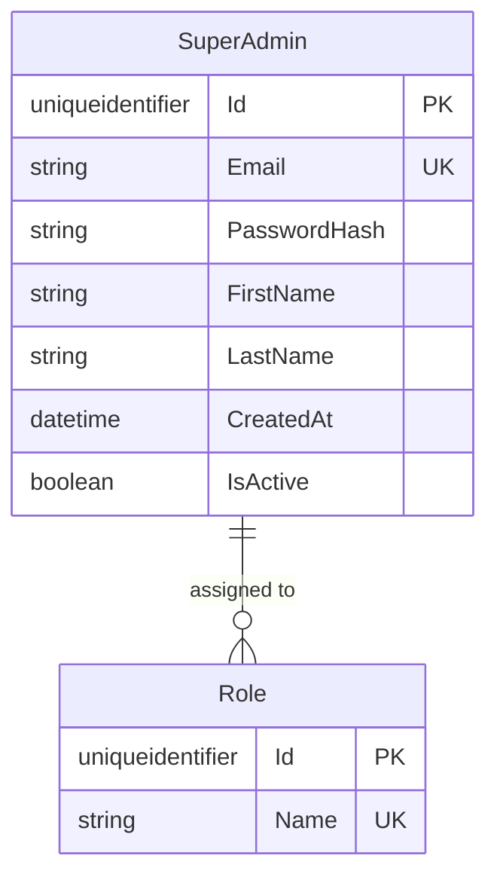
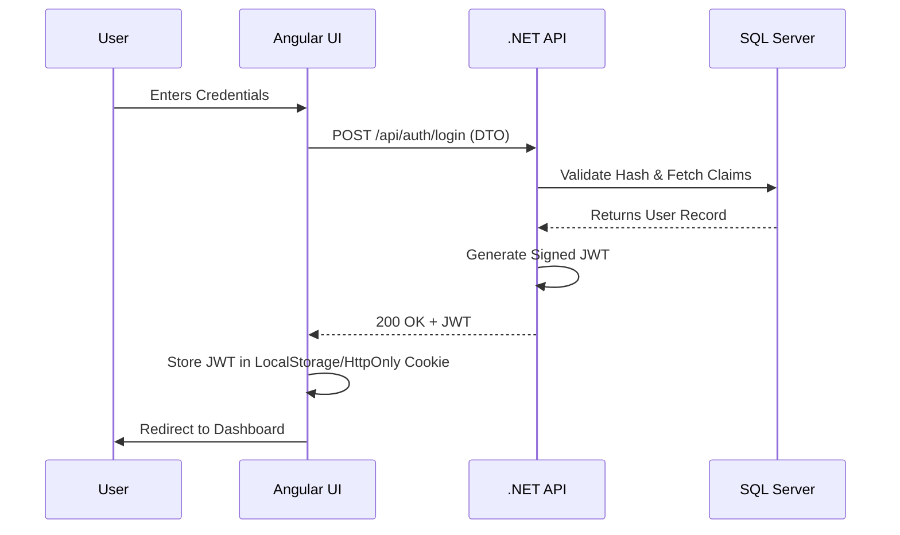

# System Design Document (SDD)

**Project Name:** E-Commerce Admin Dashboard  
**Version:** 1.1.0  
**Date:** March 2026  

---

## 1. Introduction

### 1.1 Purpose
This System Design Document (SDD) serves as the definitive technical blueprint for the E-Commerce Admin Dashboard. In alignment with Enterprise Systems Development Life Cycle (SDLC) best practices, this document details both the High-Level Design (HLD) and Low-Level Design (LLD) to ensure architectural integrity, scalability, and maintainability.

### 1.2 Scope
The system provides a centralized, secure administrative interface for managing e-commerce operations, including user administration (SuperAdmin), inventory management, and analytics. It utilizes a modern, containerized stack: **Angular 17+** (Frontend), **.NET 8** (Backend REST API), and **SQL Server 2022** (Database).

---

## 2. High-Level Design (HLD)

The High-Level Design defines the macro-architecture, system boundaries, and interactions between major components and external systems.

### 2.1 System Context Architecture
The system operates using a standard Client-Server model. The Admin interfaces with the system via a web browser, which communicates securely with the backend API.

### 2.2 Logical Architecture (Clean Architecture)
The backend enforces **Clean Architecture** (Onion Architecture), ensuring the Core domain is completely isolated from UI and Infrastructure concerns.

1. **API Layer (Presentation):** Controllers, Minimal APIs, Middleware (Error Handling, JWT Validation).
2. **Application Layer:** CQRS Handlers, DTOs, Use Cases, Interfaces (IRepository).
3. **Infrastructure Layer:** EF Core DbContext, Migrations, ASP.NET Core Identity, External API Services.
4. **Core Layer (Domain):** Enterprise Entities (e.g., `SuperAdmin`), Value Objects, Domain Exceptions.

### 2.3 Deployment Architecture
The entire stack is containerized for seamless CI/CD and deployment parity.

*   **Frontend Container:** NGINX serving compiled Angular static files.
*   **Backend Container:** .NET 8 ASP.NET Core Runtime.
*   **Database Container:** Microsoft SQL Server Linux Container.
*   **Orchestration:** Docker Compose (local) / Kubernetes or ECS (Production).

---

## 3. Low-Level Design (LLD)

The Low-Level Design breaks down the internal workings of the components defined in the HLD, providing granular details for developers.

### 3.1 Domain Model & Entity Relationship (ERD)
The initial database schema focuses on Authentication and User Management.

### 3.2 Authentication Flow (Sequence Design)
Authentication relies on stateless JWT (JSON Web Tokens).

### 3.3 API Contract Specifications
Endpoints follow strict RESTful conventions and are documented via OpenAPI/Swagger.

| Endpoint | Method | Payload (Request) | Response | Description |
| :--- | :---: | :--- | :--- | :--- |
| `/api/auth/login` | `POST` | `{ email, password }` | `200 OK { token }` | Authenticates Admin |
| `/api/users/me` | `GET` | `Headers: Bearer <token>` | `200 OK { userProfile }`| Retrieves current user info |
| `/api/users` | `POST` | `{ firstName, email, role }`| `201 Created` | Creates a new admin user |

### 3.4 Frontend Component Design (Angular)
*   **Module Strategy:** Standalone components utilizing lazy loading (`loadComponent` / `loadChildren`).
*   **State Management:** Reactive state handling via Angular Signals for UI state, and RxJS for asynchronous HTTP data streams.
*   **Interceptors:** 
    *   `AuthInterceptor`: Automatically attaches the JWT Bearer token to outgoing requests.
    *   `ErrorInterceptor`: Catches 401/403 responses globally and redirects to the login screen.

---

## 4. Non-Functional Requirements (NFRs)

### 4.1 Security
*   **Data at Rest:** Transparent Data Encryption (TDE) on SQL Server.
*   **Data in Transit:** TLS 1.2+ mandatory for all API communication.
*   **Passwords:** Hashed and salted using ASP.NET Core Identity's default PBKDF2 implementation.

### 4.2 Performance & Scalability
*   **Statelessness:** The API stores no session state, allowing horizontal scaling behind a reverse proxy/load balancer.
*   **Database Querying:** Use of `.AsNoTracking()` in EF Core for read-only operations to eliminate tracking overhead.

### 4.3 Observability
*   **Logging:** Structured logging implemented via Serilog, outputting to Console (Docker logs) and easily forwardable to ELK/Datadog.
*   **Health Checks:** Native ASP.NET Core Health Checks exposing `/health` for database and API uptime monitoring.
