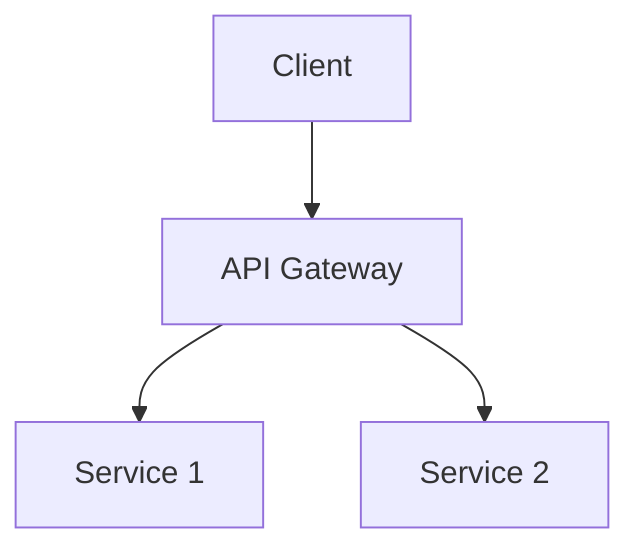

# System Architecture

## Technical Definition
Monolithic vs Microservices architecture.

## Real-World Analogy
A single massive building vs a city of specialized buildings.

## System Design Interview Tips
> 💡 **Tip:** Choose microservices when scaling teams, not just traffic.

## Diagram

