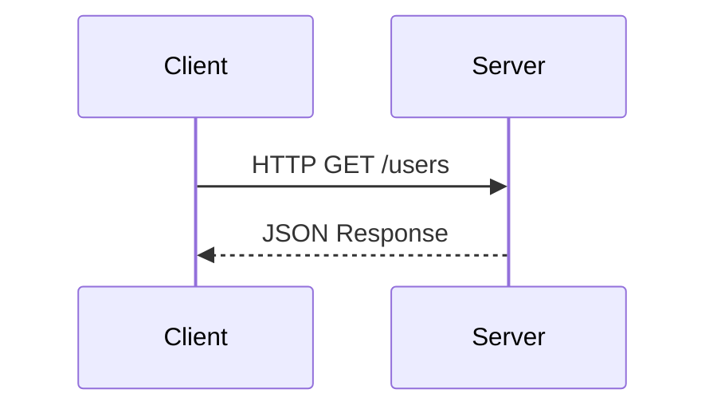

# APIs & Communication

## Technical Definition
REST, GraphQL, gRPC.

## Real-World Analogy
A restaurant menu (REST), a custom order (GraphQL), a fast-food drive-thru (gRPC).

## System Design Interview Tips
> 💡 **Tip:** Discuss latency vs payload size. gRPC is great for internal microservices.

## Diagram

