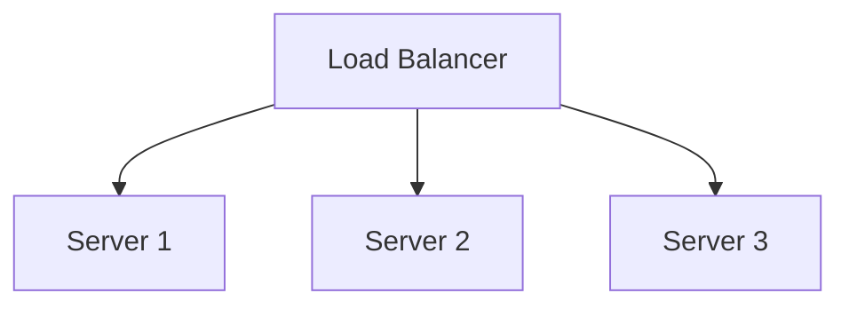

# Performance & Scaling

## Technical Definition
Vertical vs Horizontal Scaling.

## Real-World Analogy
Upgrading to a bigger truck (Vertical) vs buying a fleet of small vans (Horizontal).

## System Design Interview Tips
> 💡 **Tip:** Horizontal scaling is generally preferred for stateless services.

## Diagram

