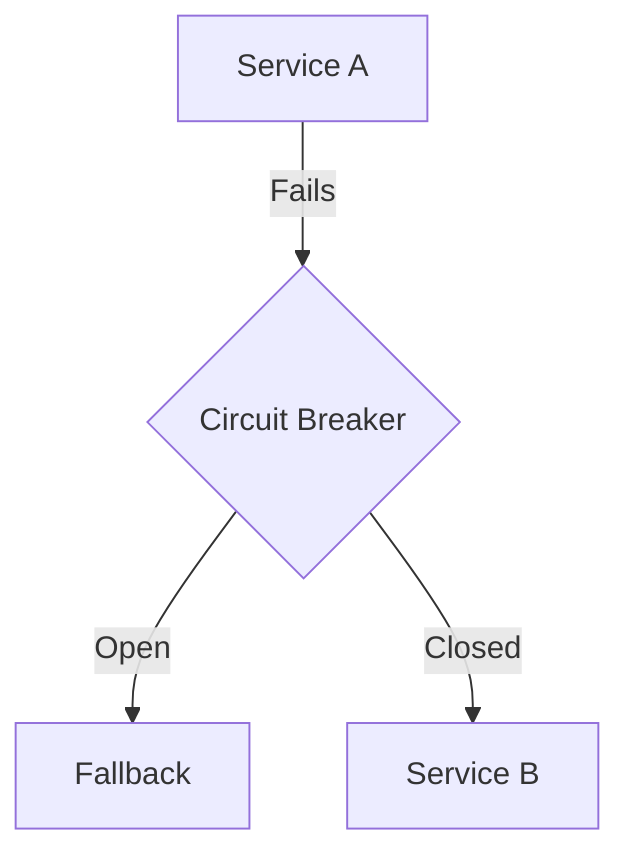

# Reliability Patterns

## Technical Definition
Circuit Breakers, Retries, Rate Limiting.

## Real-World Analogy
A circuit breaker in a house preventing an electrical fire.

## System Design Interview Tips
> 💡 **Tip:** Use exponential backoff with jitter to prevent thundering herd problems.

## Diagram

