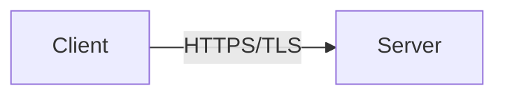

# Security

## Technical Definition
Authentication, Authorization, TLS.

## Real-World Analogy
Checking ID at the door (AuthN) vs checking VIP pass for the back room (AuthZ).

## System Design Interview Tips
> 💡 **Tip:** Never trust the client. Mention mTLS for internal service communication.

## Diagram

