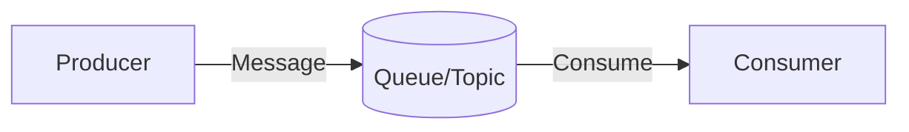

# Messaging & Async Systems

## Technical Definition
Message Queues, Pub/Sub.

## Real-World Analogy
Leaving a voicemail (Queue) vs a radio broadcast (Pub/Sub).

## System Design Interview Tips
> 💡 **Tip:** Queues decouple producers from consumers and handle traffic spikes.

## Diagram

