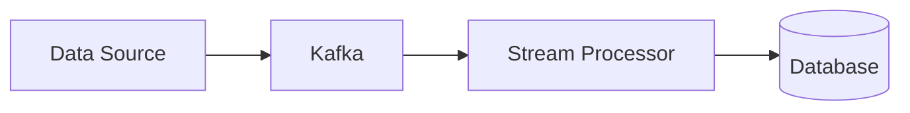

# Data Processing & Search

## Technical Definition
Batch vs Stream Processing, ElasticSearch.

## Real-World Analogy
Doing laundry once a week (Batch) vs washing clothes as they get dirty (Stream).

## System Design Interview Tips
> 💡 **Tip:** Use Elasticsearch/Solr for full-text search, not standard relational DBs.

## Diagram

