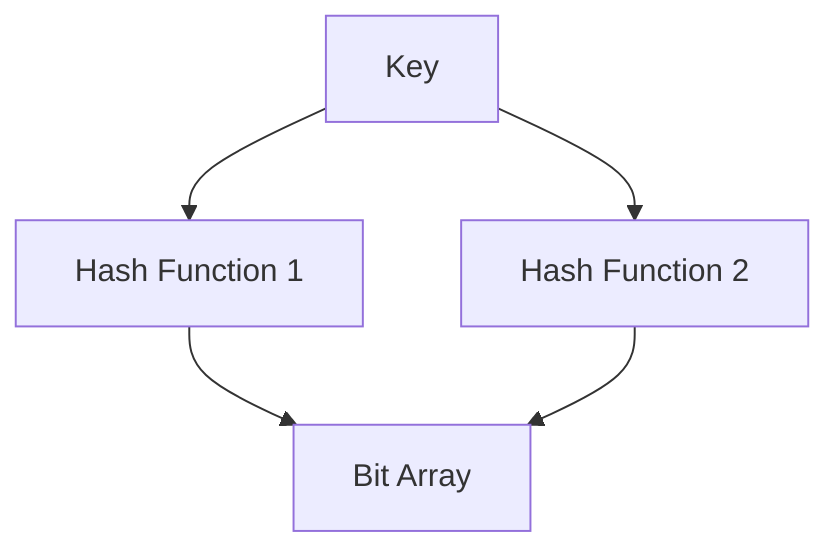

# Advanced Data Structures

## Technical Definition
Bloom Filters, HyperLogLog, Consistent Hashing.

## Real-World Analogy
A club bouncer who knows exactly who is NOT on the list (Bloom Filter).

## System Design Interview Tips
> 💡 **Tip:** Bloom filters give false positives but never false negatives. Great for cache lookups.

## Diagram

