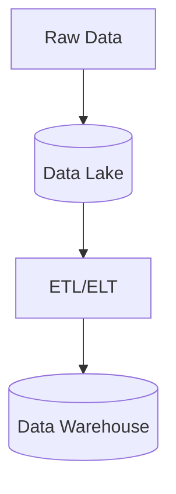

# Modern Data Platforms

## Technical Definition
Data Warehouse vs Data Lake vs Data Lakehouse.

## Real-World Analogy
A neatly organized library (Warehouse) vs a massive warehouse of raw unorganized boxes (Lake).

## System Design Interview Tips
> 💡 **Tip:** Discuss separation of compute and storage (e.g., Snowflake).

## Diagram

